<!--
  ╔══════════════════════════════════════════════════════════════════╗
  ║  Keerthana Reddy Katta — GitHub Profile README                     ║
  ║  Replace every {{PLACEHOLDER}} before publishing (see checklist    ║
  ║  at the bottom of this file).                                      ║
  ╚══════════════════════════════════════════════════════════════════╝
-->

<!-- ░░░ MOOD BANNER — raw data → insight neural net ░░░ -->
<!-- The banner.svg must live in your repo (or be hosted) for this to render.
     Once pushed, GitHub serves it and the animation plays. -->
<p align="center">
  
</p>

<p align="center">
  <a href="https://www.linkedin.com/in/katta-keerthana-reddy/">
    
  </a>
  <a href="mailto:keerthanareddy0103@gmail.com">
    
  </a>
  <a href="https://img.shields.io/badge/Location-USA-39D0D8?style=for-the-badge&logo=googlemaps&logoColor=white&labelColor=0D1117">
    
  </a>
</p>

---

> I turn **50M+ rows of raw noise** into the two or three numbers a leadership team actually acts on.
> Five years, two continents, two clouds - same obsession: make the data *say something useful.*

I'm a **Data Analyst** who lives at the seam between the warehouse and the boardroom. SQL and Python on one side, executives asking "so what?" on the other. Lately I've been teaching the old BI playbook a few new tricks with **Generative AI and Copilot**.

---

## 📊 By The Numbers

<table>
  <tr>
    <td align="center" width="25%">
      <br><b>⏳ 5+</b><br>Years in Analytics<br><sub>BI · ETL · Forecasting</sub><br><br>
    </td>
    <td align="center" width="25%">
      <br><b>📦 50M+</b><br>Records Analyzed<br><sub>at Amazon scale</sub><br><br>
    </td>
    <td align="center" width="25%">
      <br><b>🏆 2</b><br>Certifications<br><sub>PL-300 · Google DA</sub><br><br>
    </td>
    <td align="center" width="25%">
      <br><b>🎓 M.S.</b><br>Computer Science<br><sub>Oklahoma City Univ.</sub><br><br>
    </td>
  </tr>
</table>

<p align="center">
  
  
  
  
</p>

---

## 🧭 The Pivot Point - *how the story actually goes*

Most résumés read like a list of jobs. Mine reads like a migration - of geography, of cloud, and of what "analytics" even means.

**Act I · Infosys, India (2020–2023) - Learning to consolidate.**
I cut my teeth modernizing enterprise BI on **Azure** - stitching ERP, CRM, and finance systems into a single Data Lake, wiring up ADF + Databricks pipelines, and shipping Tableau dashboards that cut report generation time by 60%. This is where I learned that the hard part isn't the query; it's getting five systems to agree on what "revenue" means.

**Act II · The leap (2023–2025) - Betting on myself.**
I moved to the United States for an **M.S. in Computer Science at Oklahoma City University**. New country, new stack, deeper foundations. The academic projects (churn prediction, sales forecasting) were where I stopped just *reporting* the past and started *predicting* the future.

**Act III · Amazon, USA (2024–present) - Analytics that thinks ahead.**
Now I build customer-intelligence and revenue-optimization analytics on **AWS** for 1,000+ business users - predictive demand forecasting, executive scorecards, and increasingly **AI-augmented** workflows using Generative AI, OpenAI, and Copilot.

**The through-line:** *Azure → AWS. Reactive reporting → predictive modeling. Dashboards → decisions.* I didn't switch careers - I kept upgrading the same one.

---

## 🎯 Current Focus

```text
▹ Customer Intelligence & Revenue Optimization on AWS (Redshift · QuickSight · Glue)
▹ Predictive demand-forecasting models (Python · PySpark) - +18% accuracy
▹ Baking Generative AI + Copilot into everyday analytics workflows
▹ Automating ETL so humans never touch a manual report again (Airflow · dbt)
```

---

## 🧱 Building Blocks

<p align="center">
  
  
  
</p>
<p align="center">
  
  
  
  
</p>
<p align="center">
  
  
  
  
  
</p>
<p align="center">
  
  
  
  
  
</p>

---

## 🎚️ Where I Sit On The Stack

<em>Not a language list - an honest read on depth.</em>

| Craft | Depth | |
|---|---|---|
| **SQL & Data Warehousing** | `██████████` | Expert |
| **BI & Dashboards** (Power BI, Tableau) | `█████████░` | Expert |
| **Python for Analytics** (Pandas, PySpark) | `████████░░` | Advanced |
| **Cloud Data Platforms** (AWS, Azure) | `████████░░` | Advanced |
| **ETL / Orchestration** (Airflow, dbt, ADF) | `███████░░░` | Advanced |
| **Predictive / ML Analytics** | `██████░░░░` | Intermediate → Growing |
| **Generative AI in Analytics** | `██████░░░░` | Intermediate → Growing |

---
## 🌱 Outside the Code

<!-- The résumé didn't list hobbies, so these are placeholders.
     Swap in what's actually true — recruiters love the human bit. -->
<p align="center">
  <code>📚 Always-reading</code>&nbsp;&nbsp;
  <code>☕ Coffee-fueled queries</code>&nbsp;&nbsp;
  <code>🧩 Puzzle brain</code>&nbsp;&nbsp;
  <code>✈️ Two-continent explorer</code>
</p>

---

## 🤝 Quick Connect

<p align="center">
  <a href="https://www.linkedin.com/in/katta-keerthana-reddy/">
    
  </a>
  <a href="mailto:keerthanareddy0103@gmail.com">
    
  </a>
  <!--<a href="{{PORTFOLIO_URL}}">
    
  </a>
</p>-->

<p align="center">
  
</p>

<p align="center"><sub>“Data is only as good as the decision it unlocks.” - thanks for stopping by 👋</sub></p>

<!--
  ══════════════════════════════════════════════════════════════════
  ✅ BEFORE YOU PUBLISH — 5-minute checklist
  ══════════════════════════════════════════════════════════════════
  1. Create a repo named EXACTLY your username (e.g. github.com/keerthana → repo "keerthana").
     A README.md there becomes your profile page.
  2. Upload BOTH README.md and banner.svg to that repo's root.
  3. Find & replace these placeholders:
       {{GITHUB_USERNAME}}  – your GitHub handle
       {{LINKEDIN_HANDLE}}  – the tail of your LinkedIn URL
       {{PORTFOLIO_URL}}    – or delete that badge if you don't have one
       {{TWITTER_URL}}      – or delete that badge
  4. Edit the "Outside the Code" row to real hobbies.
  5. Note: I left your phone number OUT on purpose — a public GitHub
     profile isn't a great place for it. Add it back only if you want to.
-->
